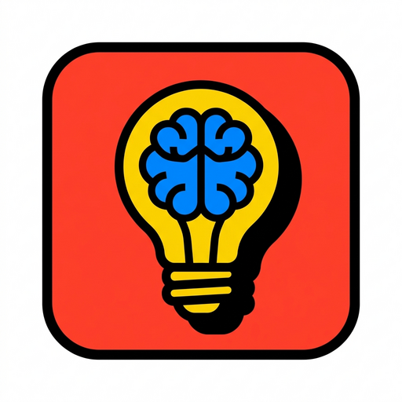
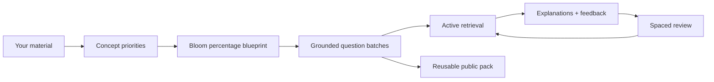
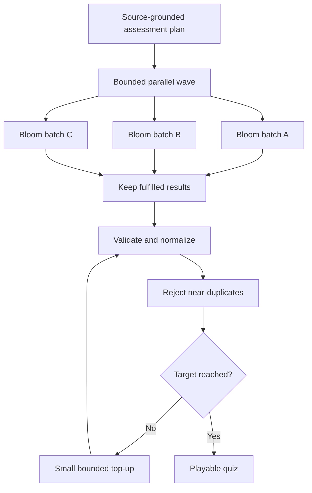
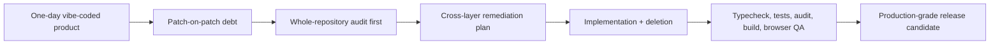
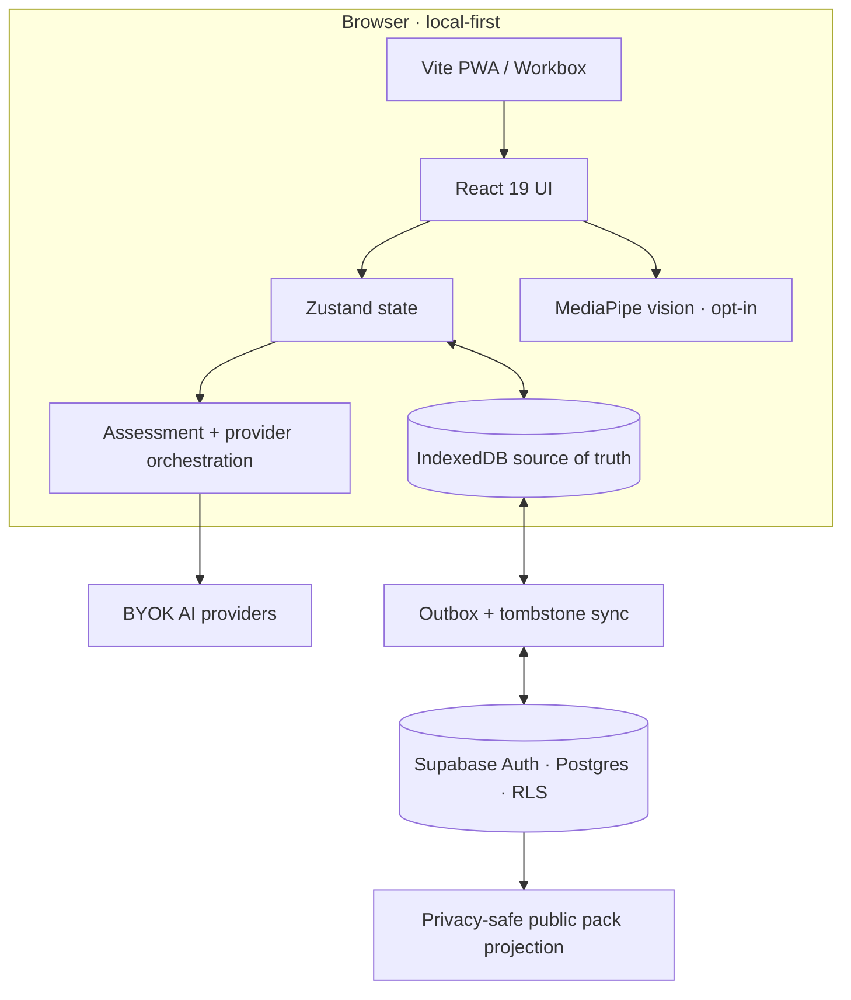
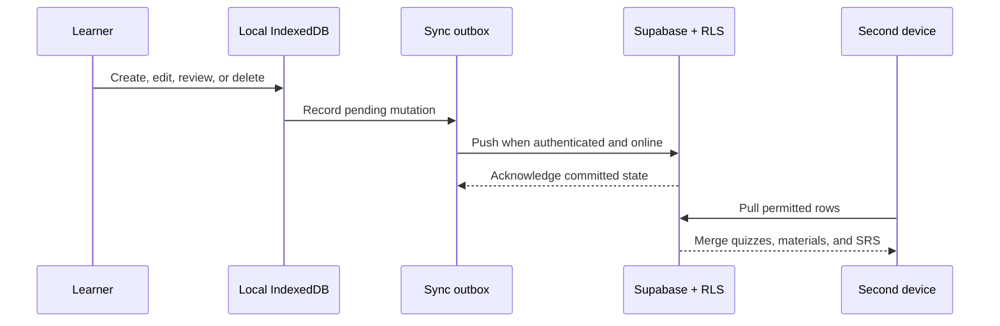

# Noodl

<p align="center">
  
</p>

<h3 align="center">Turn class material into a deliberate cognitive workout.</h3>

<p align="center">
  Noodl converts notes, PDFs, topics, and URLs into a learner-controlled Bloom assessment blueprint,<br />
  then closes the loop with retrieval practice, spaced review, accessible input, and reusable public study packs.
</p>

<p align="center">
  <a href="https://noodl-beta.vercel.app/"></a>
  <a href="https://openai.devpost.com/"></a>
</p>

<p align="center">
  <a href="https://github.com/SeraKah-1/noodl/actions/workflows/ci.yml"></a>
  
  
  
  <a href="LICENSE"></a>
</p>

<p align="center">
  <a href="#the-idea">The idea</a> ·
  <a href="#how-it-works">How it works</a> ·
  <a href="#build-week-story">Build Week story</a> ·
  <a href="#architecture">Architecture</a> ·
  <a href="#run-locally">Run locally</a> ·
  <a href="#quality-and-verification">Quality</a>
</p>

---

> **“Make it harder” is not an assessment strategy.** Real exams mix recall, understanding, application, analysis, and evaluation. Noodl turns that ambiguity into an explicit blueprint that both the learner and the model can inspect.

## OpenAI Build Week 2026

Noodl is a new Education-track project assembled during OpenAI Build Week from my own earlier learning-tool experiments. The repository was created on **July 18, 2026**; its first public sprint contains **36 commits in under 19 hours**. The rapid build proved the product idea—and exposed how quickly patch-on-patch AI coding can accumulate hidden technical debt.

| Submission evidence | Status |
|---|---|
| Competition | [OpenAI Build Week 2026](https://openai.devpost.com/) · Education |
| Source | [github.com/SeraKah-1/noodl](https://github.com/SeraKah-1/noodl) · MIT |
| Live product | [noodl-beta.vercel.app](https://noodl-beta.vercel.app/) |
| Demo video | **Pending final public YouTube upload** |
| Codex evidence | 019f7807-92f5-7843-8952-86762a81fb1b |
| Runtime model policy | Multi-provider, bring your own key |

The required GPT-5.6 use happened in the Codex engineering workflow described below. Noodl remains provider-neutral at runtime so learners are not forced into one vendor or subscription.

## The idea

Rereading creates familiarity; exams require retrieval. Generic AI quiz prompts often create a random pile of questions with unclear cognitive coverage. Noodl is designed around a more inspectable contract:



### Why Bloom percentages?

A single difficulty label hides too much. In Noodl, learners distribute the quiz across Bloom C1–C5 levels, and the system converts those percentages into explicit question targets.

| Level | Cognitive target | Example intention |
|---|---|---|
| **C1** | Remember | Recall a definition, term, or fact |
| **C2** | Understand | Explain or distinguish an idea |
| **C3** | Apply | Use the idea in a concrete situation |
| **C4** | Analyze | Compare, decompose, or infer relationships |
| **C5** | Evaluate | Judge alternatives using evidence or criteria |

Bloom is not presented as a magic accuracy guarantee. It is a shared, inspectable vocabulary for shaping an assessment. Noodl does **not** promise grades or claim that a generated quiz perfectly predicts an exam.

## How it works

### 1. Plan before generating

Noodl detects the material language, extracts concept candidates, assigns high/moderate/filler priority, and allocates question counts against the selected Bloom distribution.

### 2. Generate without one giant point of failure

One request per question is slow and encourages repetition. One enormous request is fragile: output limits or malformed JSON can destroy the whole quiz. Noodl uses bounded parallel batches instead.



The pipeline uses small independent batches, `Promise.allSettled`, concept rotation, compact memory of previously tested concepts, n-gram duplicate rejection, partial-result preservation, and bounded top-ups. If source coverage is exhausted, Smart Overflow can move upward one cognitive level rather than repeatedly asking the same fact.

### 3. Turn generation into a learning loop

| Experience | Purpose |
|---|---|
| 🎯 **Standard / Survival / Time Rush** | Different retrieval pressure without changing the source truth |
| ⌨️ **Keyboard-first quiz controls** | Answer and navigate without repetitive pointer travel |
| 🃏 **Swipeable flashcards** | Rate recall instead of memorizing one interaction pattern |
| 🧠 **Neuro-Sync** | Return weak items through an SM-2-style review schedule |
| 🧪 **Mix Room** | Combine saved units into a broader exam simulation |
| 🕸️ **Knowledge views** | Summaries, deep insights, simulations, and knowledge graphs |
| ☁️ **Public learning packs** | Generate once, distribute many times without requiring every learner to own a key |

## Accessible interaction, shaped by real failure

The first hands-free experiment used eye tracking. On ordinary consumer webcams it was too unstable and too dependent on equipment quality, so the design pivoted to the **nose tip**, a face landmark that is easier to track consistently.

- **Nose mode:** ghost pointer, dwell selection, recenter controls, and scroll priority.
- **Hand mode:** on-device gesture recognition for A–D answers and navigation.
- **Keyboard and touch remain primary:** camera input is optional, explicit, and never a trap.
- **On-device inference:** MediaPipe processes landmarks in the browser; the camera is off by default.

This is an alternative input path, not a claim of universal accessibility. Device quality, lighting, motor range, and calibration still matter.

## Build Week story

### From one-day vibe coding to an audited release candidate

I moved quickly by remixing my own quiz, flashcard, visual-learning, camera-control, and sync experiments into one product. Moving between coding agents made the surface look complete in roughly a day, but most fixes addressed the latest symptom by adding another patch. Grading, resume state, sync, sharing, provider routing, security, and accessibility quietly disagreed underneath the UI.

When I moved to Codex, I deliberately changed technique:



I did **not** ask Codex for another feature or quick patch. My first request was a senior-level repository analysis covering correctness, Clean Code, DRY, security, and UX engineering. Only after that audit found needle-in-a-haystack failures did I authorize remediation.

GPT-5.6 in Codex powered the deep analysis and long-horizon engineering workflow. I did not type the remediation code; my role was to define the product intent, challenge assumptions, and retain the key product decisions.

| Human decisions | Codex + GPT-5.6 contributions |
|---|---|
| Bloom percentage blueprint | Traced contracts from UI through generation and persistence |
| BYOK and local-first economics | Unified Quiz, Library, and SRS sync around outboxes and tombstones |
| Eye-to-nose accessibility pivot | Repaired grading, resume, SRS identity, keyboard flow, and provider routing |
| Camera privacy boundary | Hardened Supabase schema, RLS, grants, and public metadata |
| Public learning-commons model | Removed unsafe credential/runtime paths and dead code |
| Product scope and honest claims | Added tests, CI, build gates, accessible dialogs, and responsive fixes |

### Evidence, not hype

The remediation snapshot before this README:

- **52 tracked code/config files changed**
- **2,565 insertions / 3,356 deletions**—more code removed than added
- New behavioral tests, schema-security checks, CI, migration, request handling, validation, and accessible feedback primitives
- Passing TypeScript gate, test suite, production build, and production dependency audit

The important lesson was not “AI wrote thousands of lines.” It was that an agent became dramatically more useful when asked to **diagnose before mutating, preserve a plan, reason across layers, remove obsolete paths, and verify behavior before stopping**.

## Architecture



### Local-first synchronization

IndexedDB remains the immediate source of truth. Optional Supabase sync uses queued local mutations and deletion tombstones so offline changes are not silently resurrected.



## Privacy and security boundaries

- 🔑 **BYOK:** provider credentials stay client-side. Never commit keys or embed production secrets in `VITE_*` variables.
- 🗄️ **Local by default:** quizzes and progress work through IndexedDB without requiring an account.
- 🔐 **Optional cloud:** Supabase rows are scoped through authentication and Row Level Security.
- 🌍 **Safer publishing:** public discovery exposes a privacy-safe projection instead of raw private source material.
- 📷 **Camera opt-in:** vision models load only when requested and landmark processing stays in-browser.
- 🧹 **Reduced attack surface:** the remediation removed a server-credential AI endpoint and executable runtime CDN dependencies.

Review [`SECURITY.md`](SECURITY.md) before reporting a vulnerability. Do not disclose credentials or private study material in public issues.

## Run locally

### Requirements

- Node.js 20+ (CI currently verifies with Node 24)
- npm
- A supported AI-provider key for generation
- Optional Supabase project for authentication, sync, and public discovery

```bash
git clone https://github.com/SeraKah-1/noodl.git
cd noodl
cp .env.example .env.local
npm ci
npm run dev
```

Open the URL printed by Vite. The simplest secure path is to enter a provider key in **Settings → AI Providers** instead of putting a real key in a checked-in or deployed environment file.

### Supported provider paths

Noodl supports Gemini, OpenAI, Anthropic, OpenRouter, Groq, and custom OpenAI-compatible endpoints. Available model IDs are fetched dynamically where the provider supports discovery.

### Optional Supabase setup

1. Create a project at [supabase.com](https://supabase.com/).
2. Apply [`supabase/schema.sql`](supabase/schema.sql) to a fresh project, or apply the dated files under [`supabase/migrations/`](supabase/migrations/) to an existing deployment.
3. Enable Google authentication and configure localhost plus the production URL in the redirect allow-list.
4. Copy `.env.example` to `.env.local` and set:

```env
VITE_SUPABASE_URL=https://YOUR_PROJECT_REF.supabase.co
VITE_SUPABASE_PUBLISHABLE_KEY=sb_publishable_...
```

Without Supabase variables, Noodl remains usable in local guest mode. Cloud sync and public discovery are simply unavailable.

## Quality and verification

```bash
npm run lint          # strict TypeScript check
npm test              # behavior + security regression suite
npm run build         # typecheck and production PWA bundle
npm audit --omit=dev  # production dependency audit
```

CI runs install, lint, tests, build, and a high-severity production audit for pushes to `main` and for pull requests.

| Verification area | Examples |
|---|---|
| Answer correctness | Fill-blank normalization and accepted-answer behavior |
| Import boundary | Quiz payload validation and normalization |
| Network boundary | CORS allow-list behavior |
| Data security | RLS/schema/grant regression checks |
| Build integrity | TypeScript before Vite production build |

## Project map

```text
noodl/
├── components/             # Product screens and accessible UI primitives
├── contexts/               # Camera lifecycle and shared interaction state
├── hooks/                  # Hand-gesture and UI behavior hooks
├── services/               # Generation, providers, storage, sync, SRS, validation
├── store/                  # Zustand application state
├── supabase/
│   └── migrations/         # Dated database hardening changes
├── tests/                  # Node behavioral regression tests
├── .github/workflows/      # CI quality gate
├── App.tsx                 # Application shell and view lifecycle
├── types.ts                # Quiz, Bloom, storage, and review contracts
└── vite.config.ts          # Build, PWA, and performance configuration
```

## Honest limitations

- AI generation requires the learner’s provider access unless they open a pre-generated public pack.
- Camera input varies with device, lighting, framing, and motor range; it is experimental and optional.
- Bloom targets shape cognitive intent but do not guarantee that every generated question is perfectly classified.
- Public sharing and cross-device behavior require a correctly migrated Supabase deployment.
- A reproducible educator-reviewed benchmark is still needed before making any exam-similarity or grade-impact claim.

## Roadmap

- [ ] No-key sample deck for frictionless judging and onboarding
- [ ] Human-labelled Bloom and unsupported-fact evaluation set
- [ ] Performance-aware recommendations for the learner’s next Bloom mix
- [ ] Public-pack provenance, moderation, and educator curation
- [ ] Expanded assistive-input calibration and WCAG testing
- [ ] Final public demo video and Codex `/feedback` evidence

## Research direction

Noodl’s design is informed by—not validated solely by—retrieval-practice research and work on LLM question generation across Bloom levels:

- [Retrieval practice improves learning compared with repeated studying](https://pmc.ncbi.nlm.nih.gov/articles/PMC4593518/)
- [Question generation using Bloom’s Taxonomy](https://aclanthology.org/2024.bea-1.1/)

These sources motivate the direction. They do not establish that Noodl guarantees a particular score or outcome.

## Contributing

Issues and pull requests are welcome when they preserve the core principles: source-grounded generation, explicit learning design, local-first ownership, accessible interaction, and evidence-backed claims.

```bash
git checkout -b feat/your-change
npm ci
npm run lint
npm test
npm run build
```

Please never commit `.env.local`, API keys, Supabase secret/service-role keys, private source documents, or user data.

## License

Noodl is available under the [MIT License](LICENSE).

---

<p align="center">
  <strong>Use your noodle.</strong><br />
  <sub>From your material to a deliberate learning loop—then shared with anyone.</sub>
</p>
