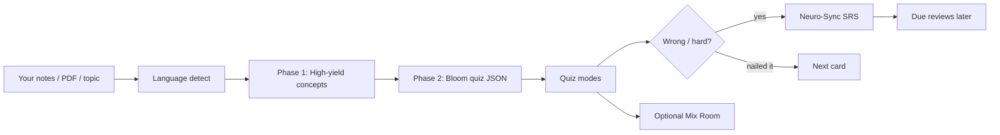
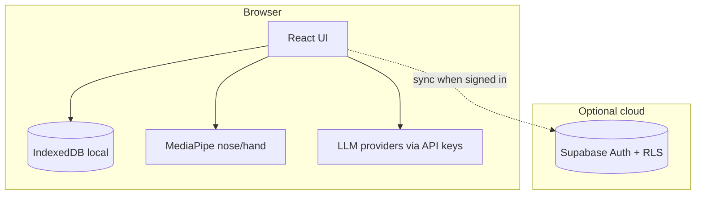
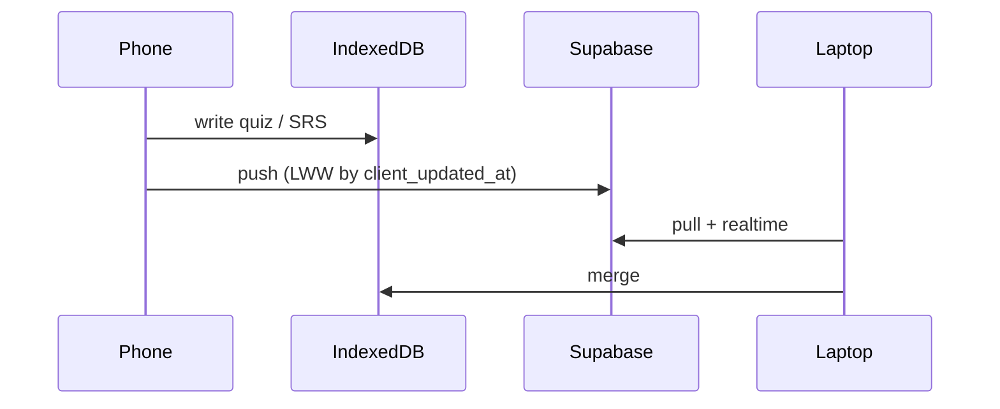

# Noodl

<p align="center">
  
</p>

<p align="center">
  <strong>Use your noodle.</strong><br/>
  Turn messy notes into high-yield quizzes — then actually remember them.
</p>

<p align="center">
  <a href="#why-noodl"></a>
  <a href="#features"></a>
  <a href="#quick-start"></a>
  <a href="LICENSE"></a>
  <a href="#hands--free-lab"></a>
</p>

---

I built Noodl because I was tired of two extremes:

1. **Passive re-reading** (“I’ve seen this page 12 times and still blank in the exam”)
2. **Generic AI quizzes** that invent facts or ask fluffy questions that never show up on tests

Noodl sits in the middle: **your material → testable concepts → Bloom-level questions → spaced repetition**.  
Not a second brain. Not an agent army. Just a sharp study loop.

---

## Why Noodl?

| Pain | What Noodl does |
|------|------------------|
| PDFs are long; exams are picky | Extracts **high-yield** concepts first (HIGH / MODERATE / FILLER) |
| “Make me 20 questions” is random | Generates by **Bloom C1–C5** with real distractor rules |
| You forget after 3 days | **Neuro-Sync** (SM-2 style SRS) brings cards back on time |
| You study in more than one language | **Multilingual**: output follows the language of *your* input |
| Accessibility / hands-busy | Optional **nose pointer** + **hand gestures** (on-device) |

I’m excited about the boring parts done well: concept ranking, language matching, retention. The glass UI is just so it doesn’t feel like homework software from 2009.

---

## Features

### Core loop
- Upload **PDF / text / topic / URL**
- Phase 1: concept map (high-yield first)
- Phase 2: quiz gen (MCQ, T/F, fill-blank optional mix)
- Modes: **Standard**, **Survival**, **Time Rush**
- Hints + explanations grounded in the material
- **Mix Room** — blend several saved quizzes into one run
- **Neuro-Sync** dashboard for due reviews
- PDF export for offline drills
- Chat-with-material + visual/deep insight tools

### AI providers
Bring your own key (Settings → Advanced):

`Gemini` · `OpenAI` · `Anthropic` · `OpenRouter` · `Groq` · `custom OpenAI-compatible`

Default path is intentionally simple. The rest is there when you want it.

### Hands-free lab (opt-in)
Camera stays **in the browser**. Default is **OFF**.

| Mode | How it works |
|------|----------------|
| **Nose** | Face landmarker → nose tip steers a ghost cursor; dwell to click; smile **or** Reset button / `R` / Space to re-center |
| **Hand** | Finger counts → A/B/C/D; open palm patterns for next/back |

Touch and keyboard always win. Hands-free is a layer, not a prison.

---

## How it works





### Multilingual (important)

We don’t hardcode “always Indonesian” or “always English.”

The model is instructed to:

1. Look at your **topic string** and/or **material text**
2. Detect the dominant language
3. Write questions, options, explanations, and hints in **that** language

Drop German notes → German quiz. Mix Spanish topic with Spanish PDF → Spanish.  
Short English topic only → English. Simple rule: **match the user.**

---

## Quick start

### Requirements
- Node 20+
- A Gemini (or other) API key
- Optional: free Supabase project for sync

```bash
git clone https://github.com/SeraKah-1/noodl.git
cd noodl
cp .env.example .env.local
npm install
npm run dev
```

Open the URL Vite prints. Paste an API key in **Settings** (or set env), drop a PDF, generate.

### Supabase (optional)

1. Create a project at [supabase.com](https://supabase.com)
2. Run [`supabase/schema.sql`](supabase/schema.sql) in the SQL editor
3. Enable **Google** under Authentication → Providers
4. Add your site URL to redirect allow-list
5. Set in `.env.local`:

```env
VITE_SUPABASE_URL=https://xxxx.supabase.co
VITE_SUPABASE_ANON_KEY=eyJ...
```

Without these, Noodl is **100% local** (guest mode). That’s a feature.

```bash
npm run build    # production bundle
npm run preview  # smoke-test the build
npm run lint     # tsc --noEmit
```

---

## Project layout

```text
noodl/
├── App.tsx                 # Shell: views, quiz lifecycle, auth gate
├── supabase.ts             # Supabase client + auth shim (local if unset)
├── supabase/schema.sql     # RLS tables: quizzes, srs_items, profiles
├── components/
│   ├── ConfigScreen.tsx    # Generator home (upload, Bloom mix, modes)
│   ├── QuizInterface.tsx   # Active quiz + hands-free toggles
│   ├── NoseTrackingManager.tsx
│   ├── GestureControl.tsx  # Hand UI
│   ├── MixRoom.tsx         # Blend saved quizzes
│   ├── NeuroSyncDashboard.tsx
│   └── ...
├── hooks/useHandGesture.ts
├── services/
│   ├── geminiService.ts    # Concept analysis + quiz gen + chat (multi-provider)
│   ├── srsService.ts       # SM-2 + local/cloud
│   ├── storageService.ts   # IndexedDB source of truth
│   ├── providerService.ts  # Which LLM backend is active
│   └── ...
├── store/useAppStore.ts    # Zustand UI state
└── types.ts                # Quiz, Bloom, SRS types
```

### Goals in the code (if you’re skimming)

| File | Goal |
|------|------|
| `geminiService.ts` | Don’t emit random trivia — rank concepts, then write diagnostic items in the **user’s language** |
| `srsService.ts` | Forgetting is normal; scheduling is the product |
| `storageService.ts` | Local first; cloud is a backpack, not a leash |
| `NoseTrackingManager.tsx` / `useHandGesture.ts` | Accessibility experiment with honest opt-in UX |
| `MixRoom.tsx` | Exam sim: mash units together without multiplayer drama |

---

## Design notes (UX we care about)

Pulled from patterns like [Design Motion HQ](https://www.designmotionhq.com/) — not as decoration, as rules:

- **Doherty (~400ms):** toggles and mode switches show feedback immediately even if the model is still loading
- **Loading system:** long quiz gen uses status steps, not an infinite mystery spinner
- **Empty states:** “no quizzes yet” points you to generate, not a blank void
- **Hands-free forgiveness:** dwell progress on targets, easy reset, touch still works
- **Peak-end:** result screen is where the dopamine is allowed to happen

---

## What we deliberately removed

From the private prototype, public Noodl drops:

- Multiplayer challenge / PvP arena  
- Voice control  
- Rhythm / “Synapse Beat” experiments  
- Server-side service-account backends in the repo  
- Hardcoded personal cloud projects  

Less surface area → fewer “why is this broken” nights.

---

## Scripts

| Command | What |
|---------|------|
| `npm run dev` | Vite dev server |
| `npm run build` | Typecheck-ish bundle via Vite |
| `npm run preview` | Serve `dist/` |
| `npm run lint` | `tsc --noEmit` |

---

## Contributing

Ideas that fit the soul of Noodl:

1. Better concept ranking for non-STEM notes  
2. Smarter language detection edge cases  
3. Hands-free calibration wizard polish  
4. Import from more note apps  
5. Tests around SRS math and prompt fixtures  

```bash
# branch, hack, PR
git checkout -b feat/your-thing
```

Please **don’t** commit API keys, Supabase service roles, or `.env.local`.

---

## Privacy (short version)

- Quiz generation uses **your** provider API key (or your proxy).  
- Hands-free models run **on-device** via MediaPipe WASM.  
- Local data: **IndexedDB**.  
- Cloud: only if you configure Supabase and sign in (RLS per user).

---


## Cross-device sync (Supabase)

Noodl is **offline-first**. IndexedDB stays primary; Supabase is the backpack between devices.



### What syncs
| Data | Table | Notes |
|------|-------|--------|
| Quizzes | `quizzes` | soft-delete via `deleted_at` |
| Library | `library_items` | materials |
| SRS cards | `srs_items` | Neuro-Sync |
| Prefs | `user_profiles` | non-secret settings |
| Devices | `devices` / `sync_state` | last sync timestamps |

### Auth
- **Google** OAuth only (guest / local-only still works)
- PKCE flow, session in `localStorage`, auto refresh
- RLS: every row scoped to `auth.uid()`
- No Cloudflare Turnstile; no GitHub OAuth for end-users

### One-time project setup

1. Sign in at [supabase.com/dashboard](https://supabase.com/dashboard)
2. Create project **noodl** (or run bootstrap below)
3. SQL Editor → paste [`supabase/schema.sql`](supabase/schema.sql) → Run
4. Authentication → Providers → enable **Google**
   - Create OAuth credentials in Google Cloud Console
   - Callback URL: `https://<PROJECT_REF>.supabase.co/auth/v1/callback`
   - Redirect URLs in Supabase: `http://localhost:3000/**`, your production URL
5. Project Settings → API → copy URL + publishable/anon key into `.env.local`

```bash
# Optional management token for bootstrap scripts:
# https://supabase.com/dashboard/account/tokens
export SUPABASE_ACCESS_TOKEN=sbp_...
npm run supabase:bootstrap
```


## License

MIT — see [LICENSE](LICENSE). Fork it, break it, make it weirder.

---

<p align="center">
  Built for people who still have finals.<br/>
  <sub>Noodl · use your noodle · not another tab you’ll forget</sub>
</p>
