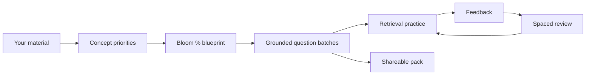
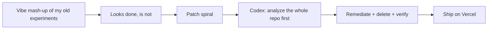
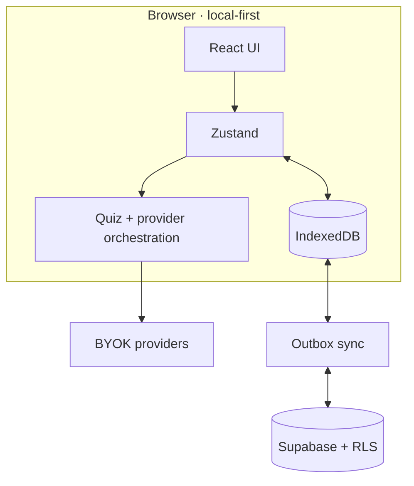

# Noodl

<p align="center">
  
</p>

<h3 align="center">Use your noodle. Turn class notes into a study loop that actually sticks.</h3>

<p align="center">
  For students who re-read until 2am and still blank on the exam.<br />
  For friends who share one deck of material and shouldn't each need their own API bill.<br />
  Built in public during <a href="https://openai.devpost.com/">OpenAI Build Week</a> · Education track.
</p>

<p align="center">
  <a href="https://noodl-beta.vercel.app/"></a>
  <a href="https://openai.devpost.com/"></a>
  <a href="LICENSE"></a>
</p>

<p align="center">
  <a href="https://noodl-beta.vercel.app/"><strong>Live demo → noodl-beta.vercel.app</strong></a>
  ·
  <a href="#why-noodl-exists">Why</a>
  ·
  <a href="#what-you-can-do">What it does</a>
  ·
  <a href="#build-week-how-this-actually-got-built">How it got built</a>
  ·
  <a href="#run-it">Run it</a>
</p>

---

## Why Noodl exists

I kept watching the same pattern: people highlight PDFs, re-read slides, feel "familiar" with the material… then freeze when the test asks them to *use* the idea. Familiarity is not retrieval. And most "AI quiz" tools just dump a pile of questions with no idea of cognitive coverage — like rolling dice and calling it a study plan.

Noodl is my stubborn answer to that. You bring **your** notes / PDF / topic / URL. You set how much of the quiz should hit remember vs understand vs apply vs analyze vs evaluate (Bloom C1–C5, as percentages you can actually inspect). Then the app generates questions grounded in that material, lets you practice under different pressure modes, and pulls weak items back later with spaced review.

If that sounds idealistic — yeah. I'm fine with that. Education is where I want AI to be *useful*, not just impressive in a demo GIF. OpenAI Build Week was the push to stop sitting on scattered experiments and ship something a real student could open tonight.

---

## Submission (Education track)

| | |
|---|---|
| Hackathon | [OpenAI Build Week 2026](https://openai.devpost.com/) · **Education** |
| Repo | [github.com/SeraKah-1/noodl](https://github.com/SeraKah-1/noodl) · MIT · **new repo (created July 18, 2026)** — not a polished multi-year product with a fake "overnight" story |
| Live product | **[https://noodl-beta.vercel.app/](https://noodl-beta.vercel.app/)** |
| Demo video | Pending public YouTube (&lt;3 min) — judges: the live app is up now |
| Codex session (`/feedback` ID) | *Paste after running `/feedback` in the Codex session that did the main remediation* — I don't keep that ID in git; it lives in the Devpost form |
| How GPT-5.6 + Codex were used | See [the story below](#build-week-how-this-actually-got-built) — analysis-first, long-horizon fixes, not "add one more feature" spam |

---

## What you can do

Drop material in. Set Bloom mix. Generate. Fight for survival mode if you're feeling spicy, or just do standard retrieval. Flashcards when you only have ten minutes. Neuro-Sync when the weak concepts come back to haunt you (they will). Mix Room if you want a mock exam from several packs. Visual lab + knowledge graph when words alone aren't enough. Optional hands-free stuff (nose / hand) because I tried pure eye tracking on a normal webcam and it was… not it.

and you can publish a **public study pack** so classmates don't each need a paid key just to *practice* — generate once, share many times. That part matters to me more than half the UI polish. Equity isn't a badge, it's "can my friend open this without an API bill."

Runtime is **bring-your-own-key** (multi-provider). Your notes stay local-first; cloud is optional. I'm not trying to own anyone's homework forever.

### Bloom, because "hard mode" is not a strategy

| Level | What you're training |
|---|---|
| C1 | Remember |
| C2 | Understand |
| C3 | Apply |
| C4 | Analyze |
| C5 | Evaluate |

You set the percentages. Noodl turns them into targets. It will not magically guarantee your grade — I'm not going to lie to judges or students about that. It *will* stop the quiz from being 100% pure recall by accident.



Generation isn't one giant fragile prompt either — parallel waves, keep what worked, top up, reject near-duplicates. Details in the code; the point is: partial failure shouldn't torch the whole study session.

---

## Build Week: how this actually got built

ok so transparency, because the commit graph will tell on me anyway.

Noodl is **new**. Repo born **July 18, 2026**. It is *not* a two-year stealth startup. What it *is*: a rework of a pile of my own earlier experiments — quiz gen, flashcards, visual lab, camera control, sync — smashed into one product during Build Week. Classic vibecoding energy. I bounced between coding agents, things looked "done" on the surface in under a day, and under the hood it was a haunted house.

I spent hours — actual hours, not "AI hours" — chasing bugs that would not die. Ask agent to fix. Agent adds more code. New bug appears. Or the old one comes back wearing a hat. Grading wrong. Resume weird. Sync hanging. Security things I didn't want to ship. Accessibility half-wired. I kept thinking maybe the foundation was just cursed.

Then I switched to **Codex** (with **GPT-5.6** under the hood, as Build Week intends) and I changed how I talked to it.

I did **not** open with "add feature X."

I asked for a full-repo analysis. Senior-level. Correctness, structure, security, the boring stuff. And the write-up hit things I genuinely did not see — needle-in-the-haystack kind of stuff. That was the first moment I went "…oh."

After that I said: fix it. I basically sat there and steered. Plan, long run, thousands of lines moved, more deleted than added in the big remediation, tests and gates appearing. Work that would have been weeks for a small team if we were doing it by hand in the old way — compressed into a night that felt unreal. Not because magic, because the *workflow* finally matched what long-horizon agentic coding is good at: understand the mess, then rewrite the mess, then prove it.

I'm still the person who decided Bloom percentages matter, that keys stay BYOK, that camera is opt-in, that public packs shouldn't leak private notes. Codex / GPT-5.6 was the force multiplier that made "idealism + production" not a joke for a one-person Build Week sprint.

If you're judging **Technological Implementation**: the interesting part isn't that an agent typed for me. It's that OpenAI's stack could hold a multi-hour plan across a messy multi-surface app and leave something I was willing to put on Vercel with my name on it.

Live: [noodl-beta.vercel.app](https://noodl-beta.vercel.app/)

Diagrams (English exports): [`docs/diagrams/`](docs/diagrams/)



---

## Architecture (short)

Browser-first. IndexedDB is the source of truth. Optional Supabase for auth/sync/public packs. Providers via settings keys. PWA shell. More diagrams in `docs/diagrams/`.



Privacy in one breath: keys client-side, camera off by default, public share is a safe projection not your raw private notes. See [`SECURITY.md`](SECURITY.md).

---

## Run it

**Needs:** Node 20+, npm, a provider API key for generation. Supabase optional.

```bash
git clone https://github.com/SeraKah-1/noodl.git
cd noodl
cp .env.example .env.local
npm ci
npm run dev
```

Open the Vite URL. Easiest path: **Settings → AI providers → paste key → Save**. Don't commit real keys.

Optional Supabase: apply `supabase/schema.sql` (or migrations), enable Google OAuth with localhost + production redirects, set:

```env
VITE_SUPABASE_URL=https://YOUR_PROJECT_REF.supabase.co
VITE_SUPABASE_PUBLISHABLE_KEY=sb_publishable_...
```

Without Supabase you still get local guest study. Sync/public packs just stay off.

### Checks

```bash
npm run lint
npm test
npm run build
```

CI runs on `main`.

---

## Project map

```text
components/   screens + UI
services/     generation, storage, sync, SRS, viz, …
store/        app state
supabase/     schema + migrations
tests/        regression checks
docs/diagrams exported architecture images
```

---

## Honest limits

- Generation needs a key unless someone opens a pre-made public pack  
- Camera modes depend on lighting / device; keyboard and touch stay primary  
- Bloom targets shape intent; they don't certify perfect classification  
- Demo video and Devpost `/feedback` session id go in the submission form, not as fake certainty in this README  

---

## Still want to build

Sample deck with no key for judges. Better educator review of question quality. Smarter "what Bloom mix next?" suggestions. Public pack moderation. More assistive-input polish.

---

## License

[MIT](LICENSE) — fork it, study with it, improve it.

---

<p align="center">
  <strong>Use your noodle.</strong><br />
  <sub>Built for OpenAI Build Week · Education · because practice &gt; passive rereading.</sub>
</p>
