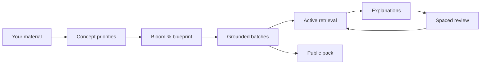
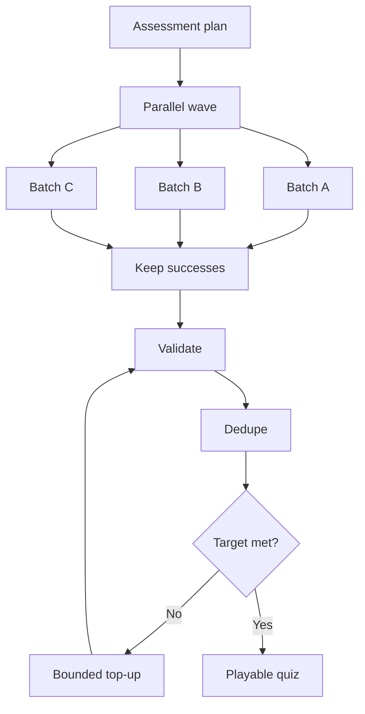
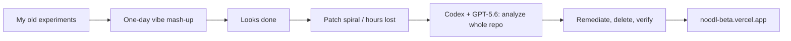
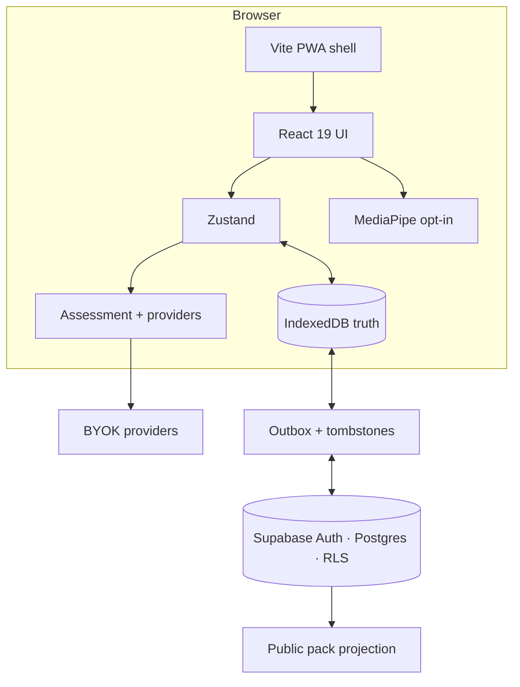

# Noodl

<p align="center">
  
</p>

<h2 align="center">Use your noodle.</h2>
<h3 align="center">Turn class material into a study loop that refuses to let you fake understanding.</h3>

<p align="center">
  <strong>Live now → <a href="https://noodl-beta.vercel.app/">noodl-beta.vercel.app</a></strong><br />
  OpenAI Build Week 2026 · <strong>Education</strong> · MIT · brand-new repo (July 18, 2026)
</p>

<p align="center">
  <a href="https://noodl-beta.vercel.app/"></a>
  <a href="https://openai.devpost.com/"></a>
  <a href="https://github.com/SeraKah-1/noodl/actions/workflows/ci.yml"></a>
  <a href="LICENSE"></a>
</p>

<p align="center">
  <a href="#i-am-actually-obsessed-with-this-problem">Why I'm obsessed</a> ·
  <a href="#the-dream-im-selling">The dream</a> ·
  <a href="#what-noodl-does-in-painful-detail">Product deep dive</a> ·
  <a href="#4-game-changers-i-refuse-to-bury-in-a-bullet-list">Game changers</a> ·
  <a href="#build-week-story-messy-and-real">Build Week story</a> ·
  <a href="#7-this-is-open-source--and-it-is-not-finished-thats-the-feature">Open source</a> ·
  <a href="#for-judges">For judges</a> ·
  <a href="#run-it-tonight">Run it</a>
</p>

---

## I am actually obsessed with this problem

Here's the thing that keeps me up.

Students (me included, friends included, basically everyone I've ever watched prepare for a midterm) do this loop: open PDF → highlight yellow → re-read until the page feels *known* → close laptop feeling productive → sit in the exam and watch the answer dissolve. That feeling of "I knew this last night" is not knowledge. It's **familiarity**. Retrieval is a different sport.

And then the market "fixed" it with AI quiz spam. Paste notes. Get 20 questions. Half of them are pure recall. Half of them hallucinate a fact that was never in the file. None of them tell you *what cognitive muscle* you're training. Difficulty slider says "hard" like that means something. It doesn't. Real exams mix remember / understand / apply / analyze / evaluate whether the app is ready or not.

So I got angry in a productive way.

**Noodl** is my answer: take *your* material (notes, PDFs, topic text, URLs, library items), force an explicit **Bloom C1–C5 percentage blueprint** you can see and edit, generate questions grounded in that source, practice under real pressure modes, pull weak concepts back with spaced review, and — this part is non-negotiable for me — let someone **publish a public study pack** so a whole class isn't blocked because only one person has an API key.

I'm not building "another chatbot with a quiz button." I'm trying to build a **deliberate cognitive workout machine** for people who refuse to confuse rereading with learning.

If that sounds ambitious for a Build Week project that didn't even exist as this repo two days ago — good. Ambition is the point.

---

## The dream I'm selling

Imagine a study group where:

1. One person does the heavy generation pass on their materials.  
2. Everyone else opens a **share link** and practices — retrieval, flashcards, spaced review — **without** each student wiring a paid model account.  
3. The quiz isn't a mystery bag. You can look at the Bloom mix and say "we're under-trained on application, bump C3."  
4. Weak concepts come back later instead of dying in a notes app.  
5. Optional hands-free modes exist for people who want them, without trapping keyboard/touch users into a camera cult.  
6. Your keys and your private notes default to **you**, not a black-box homework cloud.

That's the social value. Not "AI is cool." **Access + intentional practice + ownership.**

OpenAI Build Week exists to show what happens when builders stop treating agents as autocomplete and start treating them as multi-hour engineering partners. Noodl is my Education-track bet on that future: GPT-5.6 + Codex didn't just "help me type" — they made a production-shaped product possible in a window where solo patch-coding was failing me.

**Live demo (please click this):** [https://noodl-beta.vercel.app/](https://noodl-beta.vercel.app/)

---

## For judges (OpenAI Build Week · Education)

| Item | Where |
|---|---|
| Track | **Education** — AI that helps students (and teachers) practice on real materials |
| Working product | [noodl-beta.vercel.app](https://noodl-beta.vercel.app/) |
| Source | [github.com/SeraKah-1/noodl](https://github.com/SeraKah-1/noodl) · MIT · public |
| Repo age | **Created July 18, 2026** — check the commit graph. This is a Build Week construction, not a rebranded multi-year codebase |
| README / setup | This file · `npm ci` · `npm run dev` · key in Settings |
| Demo video | YouTube &lt;3 min (upload for Devpost) — until then the live site is the truth |
| Codex `/feedback` session ID | Goes in the **Devpost form** after you run `/feedback` in the Codex session that carried the main remediation (not stored in git) |
| How Codex + GPT-5.6 were used | Full story in [Build Week story](#build-week-story-messy-and-real) — analysis-first, long-horizon remediation, agentic planning |

Judging axes I care about matching:

- **Technological implementation** — non-trivial app, real Codex leverage, not a thin wrapper  
- **Design** — complete product loop you can run today, not a notebook screenshot  
- **Potential impact** — retrieval practice + shareable packs for real student economics  
- **Quality of idea** — Bloom-as-contract + local-first + public packs, not "GPT makes quiz"  

---

## What Noodl does (in painful detail)

### 1) You bring material. Noodl plans before it spams questions.

Input paths: upload files, paste topic, pull from library, URL flows where wired. The system looks at language, mines concept candidates, tags priorities (high / moderate / filler), then allocates question counts against **your** Bloom distribution.

This is the part I refuse to compromise on. If you can't see the plan, the model is driving. If you can see and set C1–C5 percentages, **you** are designing the workout.

| Level | Cognitive target | Example intention |
|---|---|---|
| **C1** | Remember | Term, definition, fact |
| **C2** | Understand | Explain / distinguish |
| **C3** | Apply | Use in a concrete situation |
| **C4** | Analyze | Compare, decompose, infer |
| **C5** | Evaluate | Judge with criteria |

Bloom is not magic grade prophecy. It's a shared vocabulary so learner and generator are arguing about the *same* thing.



### 2) Generation that doesn't die in one giant JSON explosion

I got burned by "one huge request" designs — token limits, malformed JSON, entire quiz gone. Noodl generates in **bounded parallel waves**, keeps fulfilled results, validates/normalizes, rejects near-duplicates, tops up when short, and can smart-overflow upward a Bloom level when the source is exhausted instead of asking the same fact five times.

Is it perfect? No. Is it engineered like I care if a student loses a 40-question set at 1am? Yes.



### 3) Practice modes that feel different on purpose

- **Standard** — clean retrieval, full explanations, keyboard-first navigation  
- **Survival** — lives on the line; pressure changes how you read every option  
- **Time Rush** — the clock is part of the workout, not decoration  
- **Retention sequences** — optional expansion so the same concepts reappear in a longer session instead of one-and-done  
- **Mixed item types** — MCQ isn't the only shape; toggle variety so you're not pattern-matching the UI  

### 4) Game changers I refuse to bury in a bullet list

This is the part where I get loud. Bloom + generate is the spine — but the *loop* is what makes Noodl feel like a product, not a prompt wrapper.

#### Flashcards you can doomscroll (Tinder energy, study brain)

I am so done with flashcard UIs that feel like filling a government form.

Noodl flashcards are **full-screen, flip-to-reveal, then swipe**:

- Tap to flip question → answer + explanation  
- **Swipe** (or rate: Lupa / Sulit / Bagus / Mudah) with motion, haptics, sound  
- Ratings feed **SRS** so "I blanked" actually changes what comes back later  
- Keyboard arrows when you're at a desk; drag when you're on a phone in bed  

The dream: studying that hijacks the same thumb muscle as doomscrolling — except instead of rotting your attention, you're burning weak concepts until they stick. Short session? Ten cards. Can't sleep? Keep swiping. That is intentional product cruelty in a good way.

#### HTML5 Visual Lab (sims you can *touch*)

Some ideas refuse to live in MCQ. Circulatory flow. Algorithm steps. Trade-offs with sliders.

Visual Lab scans a real study pack, proposes concepts + types (simulation / process flow / diagram / chart / 3D-ish), then generates **self-contained interactive HTML5** — canvas/SVG, controls, live "what just changed" feedback — sandboxed in-app. Pick the pack first (session or Files). Save sims back onto that quiz. Fullscreen when you want to show a friend.

Not a stock photo of a "smart classroom." An actual toy for the concept you're about to be tested on.

#### Knowledge Graph (your exam as a map)

After you've got questions + explanations, Noodl can build a **review map**: core / supporting / detail nodes, edges from shared language, click a node → question/answer/why. Zoom, pan, pinch, focus a branch. Export HTML/JSON if you want to keep the map outside the app.

This is for the moment after a mock exam when you don't need *more* random questions — you need to see **which islands of the material you actually own**.

#### Add more questions (grow the pack without starting over)

Finished a set and still feel thin on C4? **Add more** reuses the same topic/context/config, generates another batch against what you already have (dedupe-aware), and folds into the saved quiz. Study packs should *grow* with your anxiety, not force a full regenerate from zero.

#### Remix (same truth, new shape)

Bored of the option order? Remix shuffles structure — mixed types, reshuffled options, reordered items — so you're practicing **the idea**, not memorizing "B was always correct on card 7." One button. Instantly less gameable.

#### Mix Room / Virtual Room (exam simulation from many packs)

Midterms are never one PDF. Mix Room lets you multi-select saved quizzes, combine questions, optional "varied" transform, then launch as a full quiz **or** swipe flashcards. It's the "everything from weeks 1–6, shuffled" panic button — on purpose.

#### Study Tutor, Material Bank, bank-soal export

- **Study Tutor** — chat grounded in a chosen pack's material (not a random empty persona)  
- **Material overview / Deep Insight** — cluster what the quiz is testing; AI insight when you want the "so what do I study tonight" view  
- **Export bank soal** — JSON / CSV / PDF with or without answers for offline drills or sharing with a study group the old-fashioned way  

#### Hands-free experiments (optional, never a trap)

Nose-tip dwell pointer and hand gestures (A–D + nav) after eye-tracking on consumer webcams proved unreliable. Compact dwell UI so overlays don't eat the question. Camera **off by default**. Keyboard and touch stay first-class. This is accessibility R&D with an exit hatch, not a gimmick forced on everyone.

#### Themes, PWA, More hub, the "small" stuff that isn't small

Glass themes. Installable PWA. A **More** hub that routes to tutor / visual lab / material tools with a real pack picker (and **change source** when you picked wrong). Dynamic island-style status during heavy work. i18n. The glue that makes a Build Week app feel like something you'd open tomorrow morning, not only during judging.

### 5) Access & ownership (the political part, said out loud)

- **BYOK multi-provider** at runtime — Gemini, OpenAI, Anthropic, OpenRouter, Groq, custom OpenAI-compatible endpoints. Settings picks the model that then powers generate / chat / viz / etc.  
- **Local-first** — IndexedDB is the source of truth. Works as guest.  
- **Optional Supabase** — auth, outbox sync, tombstones, public discovery with RLS. Offline mutations shouldn't resurrect like zombies.  
- **Public packs** — privacy-safe projection so sharing doesn't mean "here is my entire private library dump."  
- **Camera optional** — nose-tip dwell / hand gestures after eye-tracking on consumer webcams proved unstable. Keyboard and touch remain primary. MediaPipe stays on-device. Camera off by default.

### 6) Diagrams for people who want to stare at the system

English exports live in [`docs/diagrams/`](docs/diagrams/) — learning loop, generation pipeline, architecture, sync, visual lab, graph UX, accessibility, provider routing, Bloom allocation, security map, and more. I generated them because if I'm going to claim architecture, I should show it.

### 7) This is open source — and it is **not finished** (that's the feature)

MIT. Public repo. Fork it. Break it. Improve Bloom heuristics. Add a better pack browser. Ship a teacher dashboard. Port flashcard SRS to your language. Fix my edge cases.

**Noodl will keep growing.** Build Week is a launch spike, not a tombstone. The backlog in my head is already longer than the README: zero-key sample decks for judges, educator review sets, smarter "what Bloom mix next," pack moderation, deeper assistive calibration, more simulation quality, classroom workflows I haven't built yet.

So:

1. **Find it out yourself** — click [the live demo](https://noodl-beta.vercel.app/), generate on *your* notes, swipe flashcards until 2am, open Mix Room, grow a pack with Add more, open the graph after you fail a concept.  
2. **Contribute** — issues and PRs that preserve source-grounded practice, inspectable learning design, local-first ownership, and honest claims.  
3. **Share the benefits** — every improvement lands for every student who shouldn't need a private engineering team to get a serious study loop.

If OpenAI Build Week is about what agentic coding unlocks for builders, open source is how that unlock becomes a public good instead of a private flex.

---

## Build Week story (messy and real)

I'm going to be annoyingly honest, because the git history is public and lying is pointless.

### This repo is new. The *ideas* are older.

Noodl as **this GitHub repository** was created **July 18, 2026**. Open the commits. It's a Build Week creature. What I *did* have was a graveyard of my own experiments — quiz generators, flashcard flows, visual/simulation toys, camera control prototypes, sync attempts — sitting in other folders and half-finished branches. Build Week was the deadline-shaped excuse to fuse them into **one** product instead of another abandoned demo.

So no: this is not "secretly a 2023 product with a fresh README." It is a rework under fire.

### Vibecoding week one energy (it worked until it didn't)

I vibecoded hard. Multiple AI coding agents. Hop agent when stuck. Ship UI that looks complete. For a while it felt like cheating physics — features appearing in hours that used to take days.

Then reality collected payment.

Under the pretty screens, systems disagreed with each other. I'd ask an agent to fix a bug. It would add more code. The symptom would move. Or a new one would spawn. I burned **hours** in pure debugging loops — grading weirdness, resume state, sync hanging forever, sharing edge cases, provider routing, security stuff I did not want to ship half-done, accessibility paths that only worked in the happy demo. I could not tell if the foundation was trash or if patch-on-patch had just buried the real bugs under new bugs.

That spiral is what a lot of "AI coding" looks like if you only ever say "fix this" without changing how you work.

### Then I used Codex the way Build Week is actually about

I moved the serious work into **Codex** powered by **GPT-5.6** — the stack OpenAI is putting in front of builders this week for a reason.

And I changed the prompt strategy completely.

I did **not** open with "add three features."

I asked for a full repository analysis. Senior engineer tone. Correctness, clean structure, security, UX engineering, the unsexy audit. Not a vibe. A **diagnosis**.

What came back genuinely shocked me. Detailed. Cross-layer. Needle-in-the-haystack findings I didn't know were there. That was the first time in the whole week I felt like the tool was smarter than my panic.

After I sat with the analysis, I authorized remediation. I typed almost no application code myself. I steered. Chat count stayed small. Runtime of the agent work was long — hours, not seconds — with large diffs, lots of deletion, tests and gates showing up, production-shaped cleanup. Stuff that would have been **weeks for a small human team** if we were grinding it classic-style compressed into a window that still feels unreal when I scroll the PR history.

What excited me most about GPT-5.6-in-Codex wasn't "it writes React." Lots of models write React. It was:

- holding a plan across a messy multi-surface app  
- understanding *deep* intent of a fix instead of local patch theater  
- agentic follow-through over long tasks  
- deleting dead paths instead of only appending  

That's the OpenAI story I'm here to tell. Build Week is a showcase of **agentic engineering**, not autocomplete cosplay — and Noodl is my Education proof that you can take a chaotic vibecoded mash-up and push it toward something I'm willing to put on Vercel with my name attached.



### What I still own as the human

Bloom-as-contract. BYOK economics. Local-first. Camera as opt-in. Public packs without leaking private source. Honest limits (no fake grade guarantees). The product *taste*. Codex accelerated implementation at a level that still makes me slightly giddy — and the direction is still mine.

---

## Architecture (for the obsessed)

Browser local-first shell:



Sync when online + signed in; offline edits queue; deletes use tombstones so they don't resurrect. Diagrams and tables: [`docs/diagrams/`](docs/diagrams/).

Security boundaries worth shouting: no production secrets in `VITE_*`, keys stay client-side, camera defaults off, public share is a projection. Details in [`SECURITY.md`](SECURITY.md).

---

## Run it tonight

### Requirements

- Node.js 20+ (CI has used Node 24)  
- npm  
- A provider API key for generation  
- Optional Supabase for auth / sync / public discovery  

```bash
git clone https://github.com/SeraKah-1/noodl.git
cd noodl
cp .env.example .env.local
npm ci
npm run dev
```

Open the Vite URL. Fastest path: **Settings → AI providers → paste key → Save → generate**.

### Optional Supabase

1. Create a project  
2. Apply [`supabase/schema.sql`](supabase/schema.sql) or migrations under [`supabase/migrations/`](supabase/migrations/)  
3. Enable Google auth; add localhost + production URLs to redirect allow-list  
4. Set:

```env
VITE_SUPABASE_URL=https://YOUR_PROJECT_REF.supabase.co
VITE_SUPABASE_PUBLISHABLE_KEY=sb_publishable_...
```

No Supabase? Local guest study still works. Cloud features just stay dark.

### Quality gates

```bash
npm run lint    # strict TypeScript
npm test        # behavior + security regressions
npm run build   # typecheck + production PWA bundle
```

CI runs install / lint / test / build / audit on `main`.

### Project map

```text
components/     product screens (40+), modals, accessible chrome
services/       generation, providers, storage, sync, SRS, viz, graph, i18n, …
store/          Zustand app state
supabase/       schema + hardening migrations
tests/          node regression suite
docs/diagrams/  exported architecture images (English)
App.tsx         shell + view lifecycle
```

---

## Honest limits (excited ≠ delusional)

- Generation needs a key unless you're opening a shared public pack  
- Camera modes depend on device and lighting; keyboard/touch stay first-class  
- Bloom targets shape intent; they don't certify perfect question taxonomy  
- Cross-device sync needs a correctly migrated Supabase project  
- Demo video + Codex `/feedback` ID belong in Devpost — live site is already up  

I'm not going to claim Noodl replaces teachers or predicts exam scores. I *will* claim it makes intentional retrieval practice more accessible and more inspectable than yellow highlighters and mystery AI quizzes.

---

## What's next (I'm not done dreaming — join in)

- Zero-key sample deck so every judge / classmate can click without configuring providers  
- Human-labeled evaluation set for Bloom / groundedness  
- Smarter recommendations for the learner's next Bloom mix  
- Public pack moderation + educator curation  
- Deeper assistive-input calibration + WCAG grind  
- Richer HTML5 sim quality and classroom-scale pack libraries  
- That &lt;3 minute YouTube walkthrough with audio covering Codex + GPT-5.6 usage  

**Want a feature?** Open an issue. **Can build it?** Open a PR. The point of MIT + public history is that Noodl shouldn't depend on one builder's sleep schedule forever.

---

## Research that feeds the idealism (not "we proved grades")

- [Retrieval practice improves learning vs repeated studying](https://pmc.ncbi.nlm.nih.gov/articles/PMC4593518/)  
- [Question generation using Bloom’s Taxonomy](https://aclanthology.org/2024.bea-1.1/)  

Direction, not a certificate.

---

## Contributing / license

PRs welcome when they preserve: source-grounded generation, explicit learning design, local-first ownership, accessible defaults, honest claims.

```bash
git checkout -b feat/your-change
npm ci && npm run lint && npm test && npm run build
```

Never commit `.env.local`, API keys, service-role secrets, or private student material.

**MIT** — [LICENSE](LICENSE) · star it, fork it, ship improvements back so more students get the loop for free.

---

<p align="center">
  <strong>Use your noodle.</strong><br />
  <sub>
    Swipe cards. Touch sims. Map your weak spots. Remix. Mix packs. Grow the quiz.<br />
    Built screaming-excited during OpenAI Build Week · Education<br />
    with Codex + GPT-5.6 as the long-horizon partner that made shipping possible<br />
    Open source on purpose — <a href="https://github.com/SeraKah-1/noodl">contribute</a> · <a href="https://noodl-beta.vercel.app/">try the demo</a>
  </sub>
</p>
